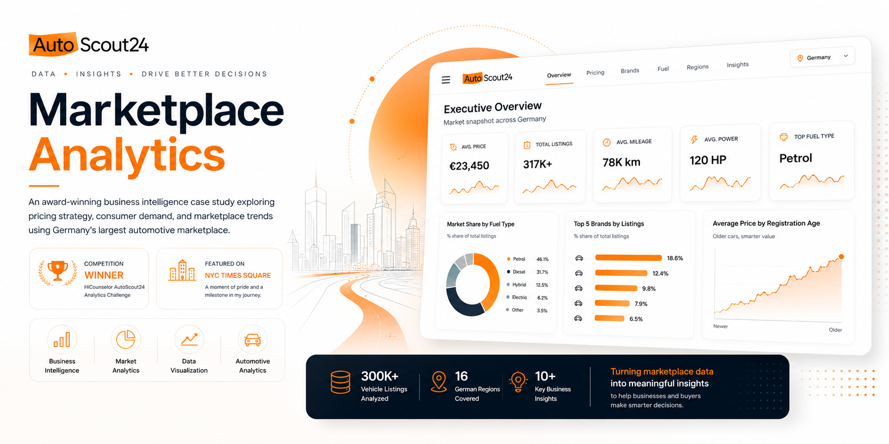
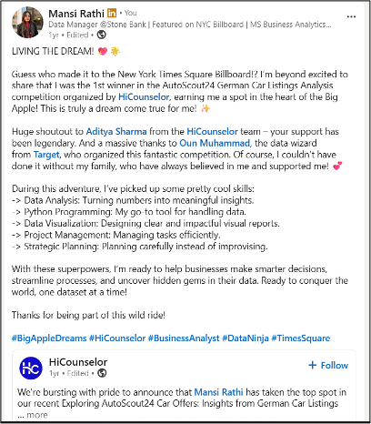

# ✦ AutoScout24 Marketplace Analytics

An award-winning business intelligence case study exploring pricing strategy, consumer demand, and marketplace trends using Germany's largest automotive marketplace.

<p align="center">
  
</p>

<p align="center">

<strong>Business Intelligence</strong> •
<strong>Market Analytics</strong> •
<strong>Tableau</strong> •
<strong>Data Visualization</strong> •
<strong>Automotive Analytics</strong>

</p>

---

# 🏆 Recognition

One of the most rewarding moments in my analytics journey came through this project.

After participating in **HiCounselor's AutoScout24 German Car Listings Analytics Challenge**, my submission was selected as the **winning project** among participants.

The project was later featured on the **New York City Times Square Billboard**, recognizing the analytical approach, business storytelling, dashboard design, and strategic recommendations developed throughout the competition.

This experience reinforced something I've always believed:

> Great analytics isn't just about building dashboards.
>
> It's about helping businesses ask better questions, uncover meaningful insights, and make smarter decisions.

---

## 🏅 Certificate of Completion

<p align="center">
  
</p>

---

## 🌃 Featured on the NYC Times Square Billboard

Seeing this project displayed in Times Square was an unforgettable milestone and one of the proudest moments of my analytics journey.

<p align="center">
  
  
</p>

---

## 💬 LinkedIn Announcement

The project was also shared on LinkedIn, where I reflected on the experience, the skills I developed, and what the competition taught me about solving real business problems through data.

<p align="center">
  
</p>

---

# 👋 Executive Summary

Buying a used car involves dozens of interconnected factors.

Price.

Mileage.

Vehicle age.

Fuel type.

Brand reputation.

Transmission.

Location.

Body style.

Condition.

For buyers, finding the right vehicle often means comparing thousands of listings across multiple variables.

For dealerships, understanding pricing trends and customer demand is equally challenging.

This project explores how marketplace analytics can transform raw listing data into meaningful business intelligence that helps both buyers and sellers make better decisions.

Using vehicle listing data from **AutoScout24**, Germany's largest online automotive marketplace, I developed an interactive analytics experience that explores pricing behavior, vehicle characteristics, regional trends, and market opportunities through modern data visualization.

Rather than focusing solely on descriptive statistics, the project aims to answer the business questions that dealerships, marketplace operators, and consumers care about most.

---

# 🚗 About AutoScout24

AutoScout24 is one of Europe's largest online automotive marketplaces, connecting millions of buyers and sellers across multiple countries.

Every day, thousands of new listings enter the marketplace, creating a rich ecosystem of pricing information, customer preferences, vehicle characteristics, and regional market trends.

This enormous volume of marketplace activity makes AutoScout24 an excellent environment for business intelligence and data-driven decision making.

Understanding this data can help answer questions such as:

- Which brands retain value best?
- How does mileage affect pricing?
- Which fuel types are growing?
- What vehicles dominate different regions?
- Which cars represent the best value?
- How do dealership pricing strategies differ?

These questions formed the foundation of this analysis.

---

# 🏢 Business Context

Online automotive marketplaces generate enormous volumes of structured data.

Every vehicle listing contributes information about:

- Price
- Brand
- Model
- Registration year
- Fuel type
- Transmission
- Mileage
- Engine size
- Horsepower
- Vehicle category
- Geographic location
- Seller characteristics

Individually, these attributes describe a single vehicle.

Collectively, they reveal how an entire marketplace behaves.

Without effective analytics, identifying meaningful pricing patterns across thousands of listings becomes extremely difficult.

Business intelligence helps transform that complexity into actionable insights that support pricing strategy, inventory planning, and customer decision-making.

---

# 🎯 Business Challenge

The challenge was not simply to visualize automotive data.

The objective was to answer meaningful business questions that could support marketplace participants.

Key challenges included:

- Understanding pricing behavior across brands
- Measuring the relationship between mileage and vehicle value
- Identifying premium versus economy market segments
- Comparing fuel preferences across listings
- Exploring geographic pricing differences
- Discovering patterns within customer purchasing options
- Identifying opportunities for dealerships
- Building dashboards that communicate insights clearly to business users

The goal was to move beyond charts and create a business intelligence experience capable of supporting strategic decisions.

---

# ❓Key Business Questions

The analysis was designed around several business-focused questions:

- Which vehicle brands command the highest average prices?
- How strongly does mileage influence resale value?
- Which fuel types dominate the marketplace?
- Which transmission types are most common?
- Which regions contain the highest-priced vehicles?
- How does vehicle age affect pricing?
- Which brands provide the strongest value proposition?
- What trends should dealerships monitor when pricing inventory?
- What insights can help consumers make more informed purchasing decisions?

Each dashboard within the project was designed to answer one or more of these questions through interactive exploration rather than static reporting.

---


# 📂 Dataset

The analysis is based on publicly available vehicle listing data from **AutoScout24**, one of Europe's largest online automotive marketplaces.

The dataset contains thousands of German vehicle listings across multiple brands, price ranges, fuel types, and geographic regions.

Representative attributes include:

- Vehicle Brand
- Model
- Price
- Registration Year
- Mileage
- Fuel Type
- Transmission
- Engine Power
- Vehicle Category
- Seller Location
- Offer Characteristics

Rather than focusing on individual listings, the project aims to identify broader marketplace patterns that can support pricing decisions, inventory planning, and customer purchasing behavior.

---

# 🧹 Data Preparation

Before beginning the analysis, the dataset was reviewed to improve consistency and analytical quality.

The preparation process included:

- Handling missing values
- Standardizing categorical attributes
- Validating price and mileage values
- Removing obvious anomalies
- Preparing calculated fields
- Creating derived business metrics
- Organizing data for interactive filtering

These steps helped ensure that the resulting dashboards reflected meaningful marketplace trends rather than inconsistencies within the raw data.

---

# 🔍 Analytical Methodology

The project followed a structured business intelligence workflow.

```text
Raw Marketplace Listings
            ↓
Data Cleaning & Preparation
            ↓
Exploratory Data Analysis
            ↓
Trend Identification
            ↓
Business Question Development
            ↓
Dashboard Design
            ↓
Insight Generation
            ↓
Business Recommendations
```

Rather than beginning with dashboard design, the analysis started with business questions and worked backward to identify the metrics needed to answer them.

---

# 🎨 Dashboard Design Philosophy

A dashboard should help users think—not simply display information.

The design emphasizes:

- Clear visual hierarchy
- Consistent color usage
- Interactive filtering
- Meaningful comparisons
- Executive-friendly summaries
- Minimal visual clutter
- Self-explanatory charts
- Business storytelling

The objective was to make complex marketplace data accessible to both technical and non-technical audiences.

---

# 🖥 Executive Marketplace Overview

The Executive Dashboard provides a high-level snapshot of marketplace activity.

<p align="center">
  
</p>

The objective is to answer one simple question:

> **"What is happening across the marketplace today?"**

Representative KPIs include:

- Average Vehicle Price
- Average Mileage
- Average Registration Year
- Total Listings
- Most Popular Brands
- Most Common Fuel Type
- Average Engine Power
- Distribution of Vehicle Categories

Instead of navigating multiple reports, users receive an immediate overview of marketplace conditions.

---

# 💰 Pricing Intelligence

Vehicle pricing is influenced by many interconnected variables.

Understanding these relationships helps dealerships develop competitive pricing strategies while helping buyers identify fair market value.

<p align="center">
  
</p>

The dashboard explores relationships between:

- Price vs Mileage
- Price vs Vehicle Age
- Price by Brand
- Price by Fuel Type
- Price Distribution
- Premium vs Economy Segments

Rather than viewing price as an isolated number, the analysis places it within the broader context of vehicle characteristics and market behavior.

---

# 🚘 Brand Performance Analysis

Brand reputation has a significant influence on resale value and customer demand.

<p align="center">
  
</p>

The dashboard enables users to compare:

- Average Price by Brand
- Listing Volume
- Market Share
- Premium Brand Positioning
- Value-Oriented Brands
- Brand Distribution

These insights help identify which manufacturers command stronger pricing power within the marketplace.

---

# ⛽ Fuel Type Analysis

Fuel preferences continue to evolve as consumer priorities, environmental regulations, and technology change.

<p align="center">
  
</p>

The analysis compares:

- Petrol
- Diesel
- Hybrid
- Electric
- Other Fuel Types

Key questions include:

- Which fuel types dominate the marketplace?
- How do prices differ across fuel categories?
- Are alternative fuel vehicles positioned as premium products?
- How is consumer demand shifting?

These findings provide valuable context for dealerships planning future inventory strategies.

---


